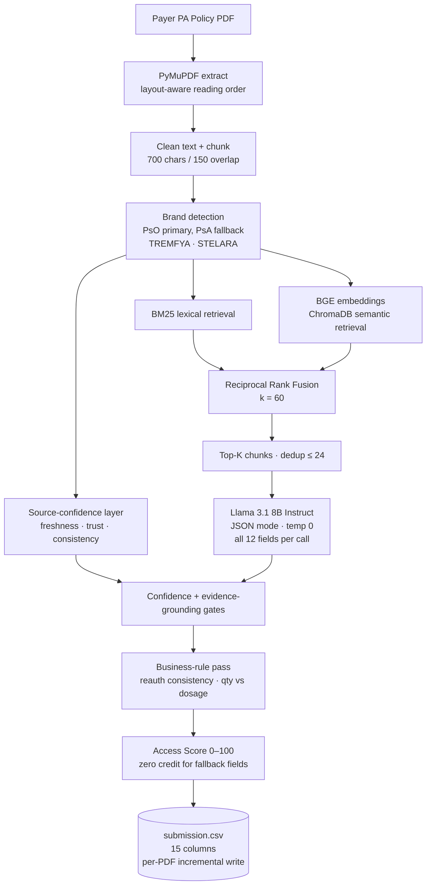

# Payer PA Policy Extraction — Hybrid RAG Pipeline

End-to-end extraction of 12 business parameters + an Access Score (0–100) from payer Prior Authorization (PA) policy PDFs.

---

## 1. How to run

We have two files :

- `zsads-rag.py` — the full pipeline
- `requirements.txt` — pinned dependencies

### Step 1 — Install dependencies

```bash
pip install -r requirements.txt
```

This installs PyMuPDF (PDF extraction), ChromaDB (vector store), sentence-transformers (embeddings), and the rest of the stack.

### Step 2 — Set your OpenRouter API key

The script was originally written for Kaggle and reads the key from Kaggle secrets. **If you're running this anywhere other than Kaggle, you must hardcode the key.** Open `zsads-rag.py`, find the block:

```python
if IS_KAGGLE:
    from kaggle_secrets import UserSecretsClient
    _secrets = UserSecretsClient()
    OPENROUTER_API_KEY = _secrets.get_secret("OPENROUTER_API_KEY")
    OPENROUTER_MODEL   = _secrets.get_secret("OPENROUTER_MODEL")
else:
    OPENROUTER_API_KEY = os.environ.get("OPENROUTER_API_KEY", "")
    OPENROUTER_MODEL   = os.environ.get("OPENROUTER_MODEL", "meta-llama/llama-3.1-8b-instruct")
```

…and replace the `else:` branch with your literal key:

```python
else:
    OPENROUTER_API_KEY = "sk-or-v1-YOUR_KEY_HERE"
    OPENROUTER_MODEL   = "meta-llama/llama-3.1-8b-instruct"
```

Get an API key at <https://openrouter.ai/keys>. The free tier is fine — Llama 3.1 8B Instruct costs about $0.02 per million tokens.

### Step 3 — Point the script at your PDFs

In the same `Configuration` section, set `PDF_DIR` to the folder that holds the policy PDFs:

```python
PDF_DIR = Path("/absolute/path/to/Sample_PsO_ADS_Track")
```

### Step 4 — Run

```bash
python zsads-rag.py
```

It will produce `submission.csv` with the 15 columns, one row per `(Filename, Brand)`.

The script writes incrementally — if it crashes midway, just re-run and it will resume from the next unprocessed PDF.

---

## 2. Models used

### 2.1 Generation LLM — Llama 3.1 8B Instruct

`meta-llama/llama-3.1-8b-instruct`, served through OpenRouter. Selected because:

- Strong JSON-mode adherence (essential for structured extraction)
- 128 k native context window (we use 8 k)
- Cheap enough to be effectively free on the OpenRouter free tier (~$0.02 per million tokens)
- Open-weights → reproducible and not tied to a closed vendor

The model is called with `temperature=0` and `response_format={"type":"json_object"}`. A system prompt forbids it from using external knowledge — every field must come back with a verbatim quote from the retrieved context.

### 2.2 Embedding model — BAAI/bge-small-en-v1.5

The dense-retrieval half of the hybrid retriever runs locally with **BAAI/bge-small-en-v1.5**:

| Property | Value |
|---|---|
| Parameters         | 33 M |
| Embedding dim      | 384 |
| Tokenizer          | BERT WordPiece, 512 max tokens |
| MTEB retrieval avg | 51.7 (competitive with larger models) |
| Runtime            | CPU-friendly, ~5–10 ms / chunk on a laptop |
| License            | MIT |

Loaded once via `HuggingFaceEmbeddings`, normalized to unit length so cosine similarity reduces to a dot product. Vectors are written into **ChromaDB** (`PersistentClient`, sqlite-backed) so they sit on disk instead of in RAM — important for the Kaggle free tier.

Chosen over BGE-large / E5-large because the policy-extraction queries are short and lexically anchored (drug names, dosages, indication codes); the larger embedder's gains don't justify the 8× memory and 5× latency cost on commodity hardware.

---

## 3. Architecture

### High-level flow

```
                          ┌────────────────────────────┐
                          │     Payer PA Policy PDF    │
                          └─────────────┬──────────────┘
                                        │
                            ┌───────────▼───────────┐
                            │   PyMuPDF extract     │  blocks sorted by
                            │   (layout-aware)      │  (column, y, x)
                            └───────────┬───────────┘
                                        │
                            ┌───────────▼───────────┐
                            │   Clean + Chunk       │  900-char chunks,
                            │   provenance-tagged   │  200-char overlap
                            └───────────┬───────────┘
                                        │
                            ┌───────────▼───────────┐
                            │   Brand detection     │ ◀── Llama 3.1 8B
                            │   (PsO → PsA fallback)│     sliding window
                            │   ⇒ TREMFYA, STELARA  │
                            └───────────┬───────────┘
                                        │
                              for each (brand, query)
                                        │
              ┌─────────────────────────┼─────────────────────────┐
              ▼                         ▼                         ▼
        ┌──────────┐              ┌──────────┐             ┌────────────┐
        │   BM25   │              │  BGE +   │             │  Source    │
        │ lexical  │              │ ChromaDB │             │ confidence │
        │ retrieval│              │ semantic │             │  freshness │
        │          │              │ retrieval│             │   trust    │
        │          │              │          │             │ consistency│
        └────┬─────┘              └────┬─────┘             └─────┬──────┘
             │                         │                         │
             └──────────┬──────────────┘                         │
                        ▼                                        │
                ┌───────────────┐                                │
                │  Reciprocal   │                                │
                │  Rank Fusion  │                                │
                │   (RRF, k=60) │                                │
                └───────┬───────┘                                │
                        │                                        │
                        ▼                                        │
                ┌──────────────┐                                 │
                │  Top-K       │                                 │
                │  chunks      │                                 │
                │ (dedup ≤24)  │                                 │
                └──────┬───────┘                                 │
                       │                                         │
                       ▼                                         ▼
              ┌───────────────────────────────────────────────────┐
              │   Constrained LLM extraction (Llama 3.1 8B)       │
              │     • JSON mode, temperature 0                    │
              │     • System prompt forbids external knowledge    │
              │     • One call returns all 12 fields per brand    │
              │     • Each field: {value, confidence, evidence}   │
              └────────────────────────┬──────────────────────────┘
                                       │
                                       ▼
                       ┌────────────────────────────┐
                       │   Confidence gate          │  drop if conf < 0.55
                       │   Evidence-grounding gate  │  drop if quote ≠
                       │                            │  any retrieved chunk
                       └─────────────┬──────────────┘
                                     │
                                     ▼
                       ┌────────────────────────────┐
                       │   Business-rule pass       │  reauth consistency,
                       │                            │  qty-limit vs dosage,
                       │                            │  auth-duration default
                       └─────────────┬──────────────┘
                                     │
                                     ▼
                       ┌────────────────────────────┐
                       │   Access Score (0–100)     │  zero credit for
                       │                            │  fallback fields
                       └─────────────┬──────────────┘
                                     │
                                     ▼
                       ┌────────────────────────────┐
                       │   submission.csv           │  appended per PDF,
                       │   (15 columns)             │  crash-safe + resumable
                       └────────────────────────────┘
```

### Same diagram, in Mermaid



---

## 4. What each component does

| Stage | What it produces | Why |
|---|---|---|
| **PyMuPDF extraction**       | Per-page text in human reading order | PA policies are full of multi-column key-value tables; `pypdf` scrambles them, PyMuPDF block-sort fixes it |
| **Cleaning + chunking**      | 700-char chunks with page + position metadata | Position metadata feeds the trust signal later |
| **Brand detection**          | List of target brands found in the doc | PsO-first then PsA fallback; scoped to TREMFYA + STELARA |
| **BM25 retriever**           | Top-12 lexical matches per query | Catches exact drug names and numerals embeddings miss |
| **ChromaDB retriever**       | Top-12 semantic matches per query | Catches paraphrases like "step therapy" ↔ "must first trial and fail" |
| **RRF fusion**               | Single ranked list (top-14) | Parameter-free, robust to score-scale mismatch |
| **Source-confidence layer**  | Three diagnostic signals per retrieval | freshness (policy age), trust (body vs template), consistency (BM25 ∩ Chroma) |
| **LLM extraction**           | JSON with 12 fields × {value, conf, evidence} | One call per brand → low overhead, shared attention across fields |
| **Confidence gate**          | Replaces low-confidence values with fallback token | Better silence than wrong |
| **Evidence-grounding gate**  | Replaces ungrounded quotes with fallback token | Catches confident-sounding hallucinations |
| **Business-rule pass**       | Spec-mandated post-processing | Reauth consistency, dosage ≠ quantity-limit, etc. |
| **Access Score**             | Integer 0–100 | Field-weighted, zero credit for fallback fields |
| **CSV writer**               | `submission.csv` appended per PDF | Crash-safe and resumable |

---

## 5. Access Score (0–100)

The Access Score is a single integer that summarizes how restrictive a payer's PA policy is for a brand — higher score means **better access** (fewer barriers to a patient getting the drug). It's computed deterministically by `compute_access_score()` from the 12 extracted fields, with no additional LLM call.

### 5.1 The seven sub-scorers

The score is the sum of seven weighted features, capped at 100:

| Feature | Max points | Scoring logic |
|---|---:|---|
| **Age threshold**          | 15 | `≤ 18 yrs → 15` · `≤ 21 → 13` · `≤ 30 → 10` · `≤ 50 → 6` · `> 50 → 3` · `FDA-labelled age → 12` |
| **Step therapy (total steps)** | 35 | sums brand + generic steps: `0 → 35` · `1 → 28` · `2 → 20` · `3 → 12` · `4 → 7` · `5+ → 3` |
| **Phototherapy required**  | 10 | `No → 10` · `Yes → 0` |
| **Initial auth duration**  | 15 | `≥ 12 mo → 15` · `6–11 mo → 8` · `< 6 mo → 4` · `Unspecified → 6` |
| **TB test required**       |  5 | `No → 5` · `Yes → 0` · `Not specified → 2` |
| **Reauthorization**        | 10 | `Not required → 10` · required, `≥ 12 mo → 7` · `6–11 mo → 4` · `< 6 mo → 2` |
| **Specialist restriction** | 10 | `No restriction → 10` · `Restricted → 5` |
| **Total**                  | **100** | |

### 5.2 Zero credit for fallback values

The critical rule: a field that came back as `"Insufficient evidence found"` or any other placeholder contributes **0 points** to its feature — not the default credit. This stops the old bug where an empty row scored 85.

Example: if `TB_Test_Required = "Insufficient evidence found"`, the TB feature contributes 0 (not 2). The score reflects what we actually verified, not what we hoped.

### 5.3 What the score means at a glance

Inspired by the FDA-anchored benchmark in the problem statement:

| Score range | Interpretation |
|---|---|
| **0–24**    | Heavily restricted access (multiple step-therapy hurdles, narrow eligibility) |
| **25–49**   | Restricted vs FDA label (some hurdles beyond the label) |
| **50–74**   | Roughly parity with FDA label |
| **75–89**   | Preferred / open access (few barriers beyond the label) |
| **90–100**  | Best-in-class access (no step therapy, broad eligibility, long auth duration) |

These bands are not hard cutoffs — they're a quick read for stakeholders. The raw integer is what gets compared against the ground-truth Access Score in the hackathon evaluation.

### 5.4 Worked example

Say a policy yields:

```
Age = ">=18"                              → 15 pts
Number_of_Steps_through_Brands = "2"      \
Number_of_Steps_through_Generic = "1"     /  → 3 total → 12 pts
Step_Through_Phototherapy = "No"          → 10 pts
Initial_Authorization_Duration = "12"     → 15 pts
TB_Test_Required = "Y"                    →  0 pts
Reauthorization_Required = "Yes"          \
Reauthorization_Duration = "12"           /  → 7 pts
Specialist_Types = "Dermatologist"        →  5 pts
                                             ───────
                                  Access Score: 64
```

That's a "roughly parity with FDA label" policy — typical for plaque-PsO biologics in the US commercial market.

---

## 6. Caching (so re-runs are nearly free)

Three persistent tiers under `.rag_cache/`:

- **L1 query cache** — `lru_cache(2048)` on normalized query strings, process-local
- **L2 retrieval cache** — `diskcache` keyed by `(doc_hash, query)`, survives restarts
- **L3 LLM-response cache** — sqlite, keyed by `(model, system_prompt, prompt)`, survives restarts

Changing code that doesn't change a prompt = free re-run. Changing a prompt = only the affected calls are re-issued.

---

## 6. Output schema

`submission.csv` has exactly these 15 columns (the hackathon submission format):

```
Filename, Brand,
Age, Step_Therapy_Requirements,
Number_of_Steps_through_Brands, Number_of_Steps_through_Generic,
Step_Through_Phototherapy, TB_Test_Required,
Initial_Authorization_Duration, Reauthorization_Duration,
Reauthorization_Required, Reauthorization_Requirements,
Specialist_Types, Quantity_Limits,
Access_Score
```
